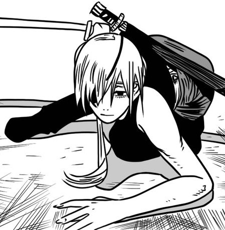

# img_to_ascii
convert image to ascii

Installation
Make sure you have Python 3 installed.

Install Pillow:

```bash
pip install pillow
```
Usage
```bash

python ascii_generator.py <image_path> width mode
```
<image_path> — Path to your image file (PNG, JPG, BMP, etc.)

width — Output width in characters (default: 100)

mode — ascii (default) or braille

## Example

Original Image:


ASCII output:
```markdown

                        :=+********+=-.
                      =%@@@@@@@@@@@@@@@%+:
                     #@@@##********##%@@@@#:
                    #@@%***************#@@@@-
                   +@@@#*****##%%%@@@@@@@@@@@-
                  .@@@#****#@@@@@%%#****#%@@@@*.
                  -@@%#****@@@#=-:::      .-*@@@:
              :-==%@@%#***#@@#*=::::..      :-%@%
            +%@@@@@@@%#***#@@#**=-:::::::::::-*@@:
           *@@@###@@@##****@@@****+====++++++*%@@:
           %@@#***@@@##****#@@@#************#%@@%
           %@@####@@@##*****%@@@@%######%%@@@@@%.
           @@@###%@@@###*****#%@@@@@@@@@@@%#%@@=
          .@@@####@@@###**********####******%@@*
          :@@%####@@@###********************%@@%
          :@@%####@@@####*******************%@@@.
          :@@%####@@@#####*****************#%@@%
          :@@%####@@@######***************##%@@#
          .@@@####@@@###########*******#####%@@+
           %@@%###@@@#######################@@@:
           =@@@%%%@@@#########%%%##########%@@%
            -%@@@@@@@%#######%@@@@@@@@@%###%@@*
              .---%@@%#######@@@##@@@%%####@@@-
                  +@@%#######@@@=.@@@######@@@.
                  -@@@#######@@@=.%@@%####%@@*
                .:=@@@%####%@@@@###@@@@@@@@@%=:.
              =##%#%@@@@@@@@@@@%####%%%%%%%%####+
              -*####%%@@@@@@%%####%#########%##*+
                 .:--====++++++++++++++====-::.
```

Original Image - QuanXi:



Braille output:
```markdown
⠀⠀⠀⠀⠀⠀⠀⠀⠀⠀⠀⠀⠀⠀⠀⠀⠀⠀⠀⠀⠀⠀⠀⠀⣠⣖⠀⣠⣄⡀⠀⠀⠀⠀⠀⠀⠀⠀⠀⠀⠀⠀⠀⠀⠀⠀⠀⠀⠀⠀⠀⠀⠀⠀⠀⠀⠀⠀⠀⠀
⠀⠀⠀⠀⠀⠀⠀⠀⠀⠀⠀⠀⠀⠀⠀⠀⠀⠀⠀⠀⠀⠀⠀⡀⣄⠉⢉⠛⠾⣟⡿⣖⣽⢤⣀⡀⠀⠀⠀⠀⠀⠀⠀⠀⠀⠀⠀⠀⠀⠀⠀⠀⠀⠀⠀⠀⠀⠀⠀⠀
⠀⠀⠀⠀⠀⠀⠀⠀⠀⠀⠀⠀⠀⠀⠀⠀⠀⠀⠀⠀⠀⠀⢰⣠⠇⠀⠀⣀⠀⠛⠋⠈⣷⠿⣿⣿⣿⣶⣦⣤⣤⡤⠤⢤⣀⣀⠀⠀⠀⠀⠀⠀⠀⠀⠀⠀⠀⠀⠀⠀
⠀⠀⠀⠀⠀⠀⠀⠀⠀⠀⠀⠀⠀⠀⠀⠀⠀⠀⠀⠀⡠⡰⠋⠀⠀⠀⠀⠀⠀⠀⠀⢀⡏⠀⠀⠈⠻⣿⣿⣿⣿⣿⣿⣷⣿⣿⣿⣿⠶⠒⠤⢄⣀⡀⠀⠀⠀⠀⠀⠀
⠀⠀⠀⠀⠀⠀⠀⠀⠀⠀⠀⠀⠀⠀⠀⠀⠀⠀⠀⠐⡏⠀⠔⠀⠀⡀⠀⠀⠀⠀⣠⠋⠀⠀⠀⠀⠀⠘⡝⣿⣿⣿⣿⣿⣿⣿⣿⣿⣿⣷⣶⣦⣤⣈⣉⠒⣄⠀⠀⠀
⠀⠀⠀⠀⠀⠀⠀⠀⠀⠀⠀⠀⠀⠀⠀⠀⠀⠀⠀⢸⡇⢰⠃⠀⢸⠁⠀⠀⢠⠞⠁⡀⢂⠀⠀⢠⢄⢸⢿⣿⣿⣿⣿⣿⣿⣶⣿⣿⣛⣿⣿⣿⣿⣿⣿⣿⣿⣦⣤⣄
⠀⠀⠀⠀⠀⠀⠀⠀⠀⠀⠀⠀⠀⠀⠀⠀⠀⠀⠀⣈⠁⠐⢰⢀⢠⡆⠇⣰⠄⢸⡿⣭⣉⢤⡆⠸⠉⣿⠋⠉⠛⠛⠿⣿⣿⣿⣇⢨⣿⡏⢣⢿⣿⢿⣿⣿⣿⠿⠿⣿
⠀⠀⠀⠀⠀⠀⠀⠀⠀⠀⠀⣀⣠⣴⣶⣶⣶⣿⣿⣿⣧⣾⣸⣿⡻⠟⠄⠁⠀⠸⠀⠀⠀⠀⣁⣶⡞⠘⠀⠀⠀⠀⠀⠈⠙⣿⣿⣾⣿⣿⣷⣿⣿⣿⡿⡻⠋⠀⠀⠀
⠀⠀⣀⣤⣤⣤⣤⣤⣤⣶⣾⣿⣿⣿⣿⣿⣿⣿⣿⣿⡿⠟⠛⠋⠉⢲⠄⣀⠀⠀⣀⣤⣐⣵⣿⣿⡇⠀⠀⠀⠀⠀⠀⠀⠀⠈⠻⣿⣿⣿⣿⣿⣿⣿⡎⠀⠀⠀⠀⠀
⠀⢼⣿⣿⣿⣿⣿⣿⣿⣿⠿⠿⣿⣿⣿⠟⠋⠉⠀⠠⠤⠤⠤⠤⠤⠀⡆⢧⠀⣴⣿⣿⣿⣿⣿⣿⣷⣴⣤⡀⠀⠀⠀⠀⠀⠀⠀⠹⣿⣿⣿⣿⣿⡿⠇⠀⠀⠀⣄⣀
⠀⠀⠈⠉⠛⠋⠉⠉⠁⠀⠀⠀⠀⠀⠀⠀⠀⠀⠀⠀⠀⠀⠀⠀⠀⠀⡇⠸⠉⡻⣿⣿⣿⣿⣿⣿⣿⣿⣿⣿⣦⣄⣀⠀⠀⠀⠀⠀⠃⠙⠿⣿⣿⡇⠀⠀⠀⠀⠒⠒
⠀⠀⠀⠀⠀⠀⠀⠀⠀⠀⠀⠀⠀⠀⠀⠀⠀⠀⠀⠀⠀⠀⠀⠀⠀⠀⡇⡀⢏⠀⠈⠛⠻⠿⠿⠿⠿⠿⠿⠿⠟⠛⠛⠢⢄⡀⠀⠀⠀⠀⠀⠈⠻⢄⠀⠀⠀⠀⠀⠀
⠀⠀⠀⠀⠀⠀⠀⠀⠀⠀⠀⠀⠀⠀⠀⠀⠀⢀⠀⠀⠀⠀⢀⣀⡀⠀⠉⠀⡞⠀⠀⠀⠀⠀⣀⠠⠤⠀⠤⠤⠤⠤⠀⣀⠀⠈⠓⣤⡀⠀⠀⠀⠀⠀⠑⢤⡀⠀⠀⠀
⠀⠀⠀⠀⠀⠀⠀⠀⠀⠀⠀⠀⠀⠀⠀⠀⠀⠀⠈⠀⠀⠈⠉⠉⠁⠲⠯⠉⠀⠀⠤⠒⠊⠁⠀⠀⠀⠀⠀⡀⠀⠀⠐⠀⠉⠁⠀⠀⠀⠀⠀⠀⠀⠀⠠⠀⣹⠀⠀⠀
⠀⠀⠀⠀⠀⠀⠀⠀⠀⠀⠀⠀⠀⠀⠀⠀⢀⠀⠀⠀⠀⠀⠀⠀⠠⠴⠒⠒⠀⠀⠀⠀⠀⠀⠀⠀⠀⠀⠀⠀⠀⠀⠀⠀⠀⠀⠀⠀⣀⣀⡀⠠⠤⠐⢂⡩⠜⠀⠀⠀
⢀⠀⠂⠀⠀⠀⠀⠀⠀⠀⠀⠀⠀⠀⠀⠈⠉⠀⠀⠀⢀⠉⠀⠄⠀⠀⠀⠀⠀⠀⠀⠀⠀⢀⣀⣀⣤⡤⠤⠤⠶⠶⠦⠨⣍⣁⠒⠒⠒⠀⠀⠉⠉⢀⠀⠀⠀⠀⠀⠀
```

Original Image - Nagi Aoe:


Braille Output:
```markdown
⣿⣿⣿⣿⣿⣿⣿⣿⣿⣿⣿⣿⣿⣿⣿⣿⣿⣿⣿⣿⣿⣿⣿⣿⣿⣿⣿⣿⣿⣿⣿⣿⣿⣿⣿⣿⣯⣿⣍⣉⣀⠀⠹⣿⣿⣿⣿⣿⣿⣿⣿⣿⣿⣿⣿⣿⣿⣿⣿⣿
⣿⣿⣿⣿⣿⣿⣿⣿⣿⣿⣿⣿⣿⣿⣿⣿⣿⣿⣿⣿⣿⣿⣿⣿⣿⣿⣿⣿⣿⣿⣿⣿⣿⣿⣿⣿⣿⣿⣿⣿⣿⣿⣿⣿⣿⣿⣿⣿⣿⣿⣿⣿⣿⣿⣿⣿⣿⣿⣿⣿
⣿⣿⣿⣿⣿⣿⣿⣿⣿⣿⣿⣿⣿⣿⣿⣿⣿⣿⣿⣿⣿⣿⣿⣿⣿⣿⣿⣿⣿⣿⣿⣿⣿⣿⣿⣿⣿⣿⣿⣿⣿⣿⣿⣿⣿⣿⣿⣿⣿⣿⣿⣿⣿⣿⣿⣿⣿⣿⣿⣿
⣿⣿⣿⣿⣿⣿⣿⣿⣿⣿⣿⣿⣿⣿⣿⣿⣿⣿⣿⣿⣿⣿⣿⣿⣿⣿⣿⣿⣿⣿⣿⣿⣿⣿⣿⣿⣿⣿⣿⣿⣿⣿⣿⣿⣿⣿⣿⣿⣿⣿⣿⣿⣿⣿⣿⣿⣿⣿⣿⣿
⣿⣿⣿⣿⣿⣿⣿⣿⣿⣿⣿⣿⣿⣿⣿⣿⣿⣿⣿⡿⣿⣿⣿⣿⣿⣿⣿⣿⣿⣿⣿⣿⣿⣿⣿⣿⣿⣿⣿⣿⣿⣿⣿⠟⠁⣿⣿⣿⣿⣿⣿⣿⣿⣿⣿⣿⣿⣿⣿⣿
⣿⣿⣿⣿⣿⣿⣿⣿⣿⣿⣿⣿⣿⣿⣿⣿⡿⠗⠒⠂⣿⣿⣿⣿⣿⣿⣿⣿⣿⣿⣿⣿⣿⣿⣿⣿⣿⣿⣿⣿⣿⣿⡏⠀⠀⣿⣿⣿⣿⣿⣿⣿⣿⣿⣿⣿⣿⣟⣿⣿
⣿⣿⣿⣿⣿⣿⣿⣿⣿⣿⣿⣻⣟⠻⠉⠀⠀⠀⠀⢸⣿⣿⣿⣿⣿⣿⣿⣿⣿⣿⣿⣿⣿⣿⣿⣿⣿⣿⣿⡏⣼⡟⠉⠑⠢⠽⣿⢿⣿⣿⢛⣿⣛⢷⣏⡛⠬⢻⣯⡐
⣿⣿⣿⣿⣿⣿⣿⣿⣿⣿⡿⡿⠋⠁⠀⠀⠀⠀⠀⢸⣿⣿⣿⣿⣿⣿⣿⣿⣿⣿⣿⣿⣿⣿⣿⣿⣿⣿⡏⠀⠀⠀⠀⠀⠀⠀⠈⠈⠁⠙⠚⠁⠈⠢⡙⢷⡀⠈⢿⣷
⣿⣿⣿⣿⣿⣿⣿⣿⣿⠏⠁⠀⠀⠀⠀⠀⠀⠀⠀⣼⣿⣿⣿⣿⣿⣿⣿⣿⣿⣿⣿⣿⡿⠋⣿⣿⢻⢳⡇⠀⠀⠀⠀⠀⠀⠀⠀⠀⠀⠀⠀⠀⠀⠀⠐⢄⠙⢦⡀⠙
⣿⣿⣿⣿⣿⠿⠟⠃⠀⠀⠀⠀⠀⠀⠀⠀⠀⠀⠀⣿⣿⣿⣿⣿⣿⡿⠿⣿⡿⠙⢡⡿⠁⣠⠿⣿⢸⠸⡇⠀⠀⠀⠀⠀⠀⠀⠀⠀⠀⠀⠀⠀⠀⠀⠀⠀⠑⢌⠻⣦
⣿⣿⠿⠛⠃⠀⠀⠀⠀⠀⠀⠀⠀⠀⠀⠀⠀⠀⢸⢻⠋⠉⢿⠀⢸⠃⢀⣿⠃⠀⡾⠁⢠⣿⠀⢿⡄⢰⠇⠀⠀⠀⠀⠀⠀⠀⠀⠀⠀⠀⠀⠀⠀⠀⠀⠀⠀⠀⠑⠌
⠛⠁⠀⠀⠀⠀⠀⠀⠀⠀⠀⠀⠀⠀⠀⠀⠀⠀⡏⣿⠀⠀⡿⠀⡏⠀⣼⢃⠴⠊⠁⠀⠀⠉⠀⠈⠑⣜⡈⠀⠀⠀⠀⠀⠀⠀⠀⠀⠀⠀⠀⠀⠀⠀⠀⠀⠀⠀⠀⠀
⠀⠀⠀⠀⠀⠀⠀⠀⠀⠀⠀⠀⠀⠀⠀⠀⠀⡸⠀⡏⠀⠀⡇⣸⠁⡸⠃⠁⠀⠀⠀⠀⠀⠀⠀⠀⠀⠈⠃⠀⠀⠀⠀⠀⠀⠀⠀⠀⠀⠀⠀⠀⠀⠀⠀⠀⠀⠀⠀⠀
⠀⠀⠀⠀⠀⠀⠀⠀⠀⠀⠀⠀⠀⠀⠀⠀⡰⠁⢸⠁⠀⠸⢠⡧⠊⠀⡀⠀⠀⠂⠀⠀⠀⠀⠀⠀⠀⠀⢀⠀⠀⡀⠀⠀⠀⠀⠀⠀⠀⠀⠀⠀⠀⠀⠀⠀⠀⠀⠀⠀
⠀⠀⠀⠀⠀⠀⠀⠀⠀⠀⠀⠀⠀⠀⣠⣾⠁⠀⠃⠀⠀⢣⡟⠁⠀⠀⠀⠔⠀⠀⠀⠀⠀⠀⠀⠀⠀⠀⠐⠀⠀⠈⠑⠢⢤⣀⠀⠀⠀⠀⠀⠀⠀⠀⠀⠀⠀⠀⠀⠀
⠀⠀⠀⠀⠀⠀⠀⠀⠀⠀⠀⠀⠀⣞⡽⠃⠀⠀⠀⠀⣠⠏⡇⠀⢀⠠⠂⠀⠀⠀⠀⠀⠀⠀⠀⠀⠀⠀⠀⠀⠀⠀⠀⠀⠀⠈⠙⠳⢦⣄⣀⠀⠀⠀⠀⠀⠀⠀⠀⠀
⠀⠀⠀⠀⠀⠀⠀⠀⠀⠀⠀⠀⣠⠟⠀⠀⠀⠀⠀⣼⠏⠀⢡⠀⢸⠀⠀⠀⠀⠀⠀⠀⠀⠀⠀⠀⠀⠀⠀⠀⢀⠀⠀⠀⠀⠀⠀⠀⠀⠈⠻⣷⣦⡀⠀⠀⠀⠀⠀⠀
⠀⠀⠀⠀⠀⠀⠀⠀⠀⠀⢀⡾⠃⠀⠀⠀⠀⠀⢀⡟⠀⠀⠀⠑⢄⣃⠀⠀⠀⠀⠀⠀⠀⠀⠀⠀⠀⠀⠀⠀⠀⠀⢀⠀⠀⠀⠀⠀⠀⢰⠀⢻⣿⡇⠀⠀⠀⠀⠀⠀
⠀⠀⠀⠀⠀⠀⠀⠀⠀⢠⡿⠁⠀⠀⠀⠀⠂⡀⣸⠀⠀⠀⠀⠀⠀⠈⢢⡀⠀⠀⠀⠀⠀⠀⠀⠀⠀⠀⠀⠀⠀⠀⠘⠒⠈⠀⠀⠀⠀⠘⠀⠈⠁⠀⠀⠀⠀⠀⠀⠀
⠀⠀⠀⠀⠀⠀⠀⠀⠰⣹⠁⠀⠀⠀⠀⠘⢠⠃⣿⡄⠀⠰⣄⠀⠀⠀⠀⠑⣄⠀⠀⠀⠀⠀⠀⠀⠀⠀⠀⠀⠀⠀⠀⠀⠀⠀⠀⠀⠀⠀⠀⠀⠀⠀⠀⠀⠀⠀⠀⠀
⠀⠀⠀⠀⠀⠀⠀⠀⢠⣿⠀⠀⠀⠀⡀⢀⢸⢰⢻⣇⠀⠀⠙⢕⢄⠀⠀⠀⠈⢦⡀⠀⠀⠀⠀⠀⠀⠀⠀⠀⠀⠀⠔⠀⠀⠀⠀⠀⠀⠀⠀⠀⠀⠀⠀⠀⠀⠀⠀⠀
⠀⠀⠀⠀⠀⠀⡇⠀⠘⡏⣆⠀⠀⠀⢁⠘⣿⣿⡌⢿⣄⠀⠀⠀⠱⡑⢄⠀⠀⠀⠑⣄⠀⠀⠀⠀⠀⠀⡠⠔⠈⠀⠀⠀⠀⠀⠀⠀⠀⠀⠀⠀⠀⠀⠀⠀⠀⠀⠀⡀
⠀⠀⠀⠀⠀⠀⠈⠂⠀⠑⠏⠓⣦⠤⣤⡑⢾⣯⣻⠾⡏⠁⠀⠀⠀⠈⠢⠍⠀⠀⠀⣈⠳⢄⡀⠀⠀⠀⠀⠀⠔⠈⠀⠀⠀⠀⠀⠀⠀⠀⠀⠀⠀⠀⠄⠂⠈⠁⠀⠀
⣀⡀⢀⠀⠀⠀⠀⠀⠀⠀⠀⠀⣿⣤⣡⡄⠄⡀⠈⠀⠙⣦⠀⠀⠀⠀⠀⠀⠀⠀⠀⠀⠀⠀⠉⣒⣂⠶⠦⠤⠤⠤⠤⠤⠤⠀⠒⠒⢀⠂⢈⡇⠀⠀⠀⠀⠀⠀⠀⠀
⠀⠀⠀⠀⠀⠀⠀⠀⠐⠀⠀⣸⣿⣿⣿⣯⣴⣷⣺⣴⣿⣽⠀⠒⠒⠒⠒⠒⠂⢀⣉⣩⠥⠖⠒⠉⠀⠀⠀⠀⠀⠀⠀⠀⠀⠀⠀⠀⡎⠀⢸⡇⠀⠀⠀⠀⠀⠀⠀⠀
⠿⠿⠟⠛⠿⠛⠛⠛⠛⠛⠓⣿⣿⣿⣿⣿⣿⢿⣫⡿⣑⡘⠻⡦⠤⠖⠒⣚⣯⠍⠁⠀⠀⠀⠀⠀⠀⠀⠀⠀⠀⠀⠀⠀⠀⠀⠀⠀⡇⠀⣿⡇⠀⠀⠀⠀⠀⠀⠀⠀
⠀⠀⠀⠀⠀⠀⠀⠀⠀⠀⠀⢹⣿⣿⣿⣿⣿⣿⣽⣾⣿⣴⣰⣆⣦⣴⡞⠋⠀⠀⠀⠀⠀⠀⠀⠀⠀⠀⠀⠀⠀⠀⠀⠀⠀⠀⠀⢸⠁⠆⣿⠇⠀⠀⠀⠀⠀⠀⠀⠀
⠀⠀⠀⠀⠀⠀⠀⠀⠀⠀⠀⠘⣿⣿⣿⣿⣿⣿⣿⣿⣿⣿⣿⣿⡻⡶⠰⠀⠀⠀⠀⠀⠀⠀⠀⠀⠀⠀⠀⠀⠀⠀⠀⠀⠀⠀⠀⢸⠀⠀⣿⠀⠀⠀⠀⠀⠀⠀⠀⠀
⠀⠀⠀⠀⠀⠀⠀⠀⠀⠀⢀⣴⣿⣿⣿⣿⣿⣿⣿⣿⣿⣿⣿⣿⣿⣿⣧⣖⣒⡀⢀⠀⠀⠀⠀⠀⠀⠀⠀⠀⠀⠀⠀⠀⠀⠀⠀⡏⠀⢰⣿⠀⠀⠀⠀⠀⠀⠀⠀⠀
⠛⠛⠛⠛⠛⡛⣻⡿⠟⣻⣿⣿⣿⣿⣿⣿⣿⣿⣿⣿⣿⣿⣿⣿⣿⣿⣿⣷⣧⡧⢴⠂⠈⠀⡀⠀⠀⠀⠀⠀⠀⠀⠀⠀⠀⠀⢠⠇⡶⢸⣿⡄⠀⠀⠀⠀⠀⠀⠀⠀
⠀⠀⠀⠀⢸⣿⣿⠁⣰⣿⣿⣿⣿⣿⣿⣿⣿⣿⣿⣿⣿⣿⣿⣿⣿⣿⣿⣿⣿⣿⣖⣿⠼⠄⢀⠀⠀⠀⠀⠀⠀⠀⠀⠀⠀⠀⣸⠀⠀⣿⣿⡇⠀⠀⠀⠀⠀⠀⠀⠀
⣷⠶⠶⠶⠘⠛⠻⠀⣿⣿⣿⣿⣿⣿⣿⣿⣿⣿⣿⣿⣿⣿⣿⣿⣿⣿⣿⣿⣿⣿⣿⣷⣿⣶⣦⡶⡀⠠⡀⠀⠀⠀⠀⠀⠀⢠⡇⠐⢰⣿⣿⡇⠀⠻⠛⠛⠛⠛⠛⠛
⣿⣿⣷⣎⣁⣀⣀⣸⣿⣿⣿⣿⣿⣿⣿⣿⣿⣿⣿⣿⣿⣿⣿⣿⣿⣿⣿⣿⣿⣿⣿⣿⣿⣿⣿⣿⣿⣯⣢⣄⡀⠀⠀⠀⠀⣼⣰⠇⣾⣿⣿⡇⠀⢠⠀⠀⠀⠀⠀⠀
⣿⣿⣛⣿⣯⣭⣭⣹⣿⣿⣿⣿⣿⣿⣿⣿⣿⣿⣿⣿⣿⣿⣿⣿⣿⣿⣿⣿⣿⣿⣿⣿⣿⣿⣿⣿⣿⣯⣿⣬⣴⢄⣀⣄⢰⣇⡋⣸⣿⣿⣿⡇⠀⣿⠀⠀⠀⠀⠀⠀
⣿⣿⣿⣿⣿⣟⣿⣿⣿⣿⣿⣿⣿⣿⣿⣿⣿⣿⣿⣿⣿⣿⣿⣿⣿⣿⣿⣿⣿⣿⣿⣿⣿⣿⣿⣿⣿⣿⣿⣿⣿⣛⡲⢀⣿⡼⣰⣿⣿⣿⣿⡇⠀⣿⠀⠀⠀⠀⠀⠀
⣿⣿⣿⣿⣿⣿⣿⣿⣿⣿⣿⣿⣿⣿⣿⣿⣿⣿⣿⣿⣿⣿⣿⣿⣿⣿⣿⣿⣿⣿⣿⣿⣿⣿⣿⣿⣿⣿⣿⣿⣿⣿⣿⣾⣿⢳⣿⣿⣿⣿⣿⡇⠀⣿⠀⠀⠀⠀⠀⠀
⣿⣿⣿⣿⣿⣿⣿⣿⣿⣿⣿⣿⣿⣿⣿⣿⣿⣿⣿⣿⣿⣿⣿⣿⣿⣿⣿⣿⣿⣿⣿⣿⣿⣿⣿⣿⣿⣿⣿⣿⣿⣿⣿⣿⣇⣿⣿⣿⣿⣿⡿⡀⠀⣿⠀⠀⠀⠀⠀⠀
⣿⣿⣿⣿⣿⣿⣿⣿⣿⣿⣿⣿⣿⣿⣿⣿⣿⣿⣿⣿⣿⣿⣿⣿⣿⣿⣿⣿⣿⣿⣿⣿⣿⣿⣿⣿⣿⣿⣿⣿⣿⣿⣿⣿⣿⠋⠉⢹⠉⠉⠁⠑⡀⣿⠀⠀⠀⠀⠀⠀
⣿⣿⣿⣿⣿⣿⣿⣿⣿⣿⣿⣿⣿⣿⣿⣿⣿⣿⣿⣿⣿⣿⣿⣿⣿⣿⣿⣿⣿⣿⣿⣷⣾⣿⣭⡉⣛⡛⠛⠻⠿⠿⠿⠽⠃⠀⠀⠎⠀⠀⠀⠀⠱⣿⠀⠀⠀⠀⠀⠀
⣿⣿⣿⣿⣿⣿⣿⣿⣿⣿⣿⣿⣿⣿⣿⣿⣿⣿⣿⣿⣿⣿⣿⣿⣿⣿⣿⣿⣿⣿⣿⣿⣿⣿⣿⣿⣿⣧⠈⠁⠀⠀⠀⠀⠀⠀⡘⠀⠀⡀⠀⠀⢨⣿⠀⠀⠀⠀⠀⠀
⣿⣿⣿⣿⣿⣿⣿⣿⣿⣿⣿⣿⣿⣿⣿⣿⣿⣿⣿⣿⣿⣿⣿⣿⣿⣿⣿⣿⣿⣿⣿⣿⣿⣿⣿⣿⣿⣿⡇⠀⠀⠀⠀⠀⠀⠰⠁⢠⢞⠄⠀⣠⢼⣿⠀⠀⠀⠀⠀⠀
⣿⣿⣿⣿⣿⣿⣿⣿⣿⣿⣿⣿⣿⣿⣿⣿⣿⣿⣿⣿⣿⣿⣿⣿⣿⣿⣿⣿⣿⣿⣿⣿⣿⣿⣿⣿⣿⣿⣷⠀⠀⠀⠀⠀⢠⣃⣔⣁⣡⣄⣈⣁⣼⣿⠀⠀
```
